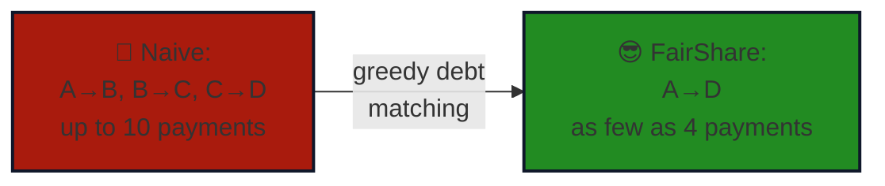

<div align="center" id="top">


<h2 align="center">an expense splitter that actually does the math, so your group doesn't have to</h2>

<br>

[](https://fairshare-expense-splitter.vercel.app/)

<br>


<br>

<code>0 dependencies</code> &nbsp;·&nbsp; <code>3 files</code> &nbsp;·&nbsp; <code>O(n) settlement</code> &nbsp;·&nbsp; <code>2 sign-in methods</code> &nbsp;·&nbsp; <code>MIT licensed</code>

<br>

</div>


<br>

<table>
<tr>
<td width="70%" valign="top">

### 🫠 The Problem

Someone books the Airbnb. Someone else grabs the cab. A third person "gets the next one" and conveniently never does. By day three, nobody remembers who fronted what — so everyone just quietly stops asking, and somebody ends up eating the cost.

### 💡 The Fix

**FairShare** logs every expense the moment it happens — who paid, how much, and how it's split — and keeps a running, real-time balance for each person. When it's time to settle, it doesn't just list raw debts; it collapses them into the *smallest possible number of payments*. No spreadsheets, no mental math, no "wait, didn't I already pay you back?"

</td>
<td width="30%" valign="top">

```
  ₹ input:  chaos
  ↓
  🧮 greedy debt
     matching
  ↓
  ₹ output: 1, 2, 3
     clean payments
```

</td>
</tr>
</table>

<br>

## 🔑 Try It — Zero Signup

<div align="center">

| | |
|:---:|:---:|
| 📧 Email | `admin@gmail.com` |
| 🔑 Password | `@123456` |

**[▶ Launch the live demo](https://fairshare-expense-splitter.vercel.app/)**

</div>

> Shared public account — data may reset without warning. For anything real, use **Guest Mode** (zero setup) or sign up free.


<br>

## 📸 A Look Inside

<table align="center">
<tr>
<td align="center" width="50%">

<br><sub><b>🔐 Sign In</b> — email, Google, or skip straight to Guest Mode</sub>
</td>
<td align="center" width="50%">

<br><sub><b>📊 Dashboard</b> — members, expenses, balances, and settlements at a glance</sub>
</td>
</tr>
</table>

<br>

## ✨ Feature Drop

<details open>
<summary><b>👥 Members</b></summary>
<br>

Add or remove people with a click — each one gets a colorful, uniquely tinted chip. Remove someone mid-trip and every balance recalculates instantly across the whole group, no page reload.
</details>

<details>
<summary><b>💰 Expenses</b></summary>
<br>

Log an expense, pick who paid, and choose how it's split. Equal splits divide automatically; custom splits let you type in exact amounts per person, and FairShare won't let you submit until they add up to the rupee. Made a mistake? Edit or delete any entry, anytime.
</details>

<details>
<summary><b>🤝 Settlement Engine</b></summary>
<br>

Every member's balance gets netted down to a single number — owed or owing. A greedy algorithm then pairs the biggest debtor with the biggest creditor, over and over, until the group lands on the mathematically minimum number of payments.
</details>

<details>
<summary><b>🔐 Accounts</b></summary>
<br>

Sign in with Google, use Email/Password, or skip accounts entirely with Guest Mode — your trip data works the same way either way, just choose how much persistence you need.
</details>

<details>
<summary><b>☁️ Cloud Sync</b></summary>
<br>

Signed-in accounts are backed by Firebase Authentication and Cloud Firestore, so your data isn't stuck on one device — start logging expenses on your laptop, check balances from your phone.
</details>

<br>

## 🧠 How Settlement Actually Works



Every balance gets netted to a single number — positive if you're owed, negative if you owe. The largest debtor pays the largest creditor, on repeat, until the whole group is even.


<br>

## ⚡ Run It Yourself

```bash
git clone https://github.com/anshikagknp/fairshare-expense-splitter.git
cd fairshare-expense-splitter
open index.html
```

No `npm install`. No build step. No bundler. Pure HTML/CSS/JS — it just runs.

Want persistent cloud accounts? Drop your free [Firebase](https://console.firebase.google.com) project config into `script.js`. Skip it and **Guest Mode** still works perfectly out of the box.

<br>

## 🎨 Design DNA

<div align="center">

`thick black borders` · `hard offset shadows` · `loud pastel palette` · `springy micro-interactions` · `neo-brutalist`


</div>

<br>


<div align="center">

### Made with 🩶 by Anshika Gupta

<a href="https://github.com/anshikagknp"></a>
<a href="https://www.linkedin.com/in/anshikagknp/"></a>
<a href="https://fairshare-expense-splitter.vercel.app/"></a>

<br><br>

<sub>MIT Licensed · © 2026 · <a href="#top">back to top ↑</a></sub>

</div>
